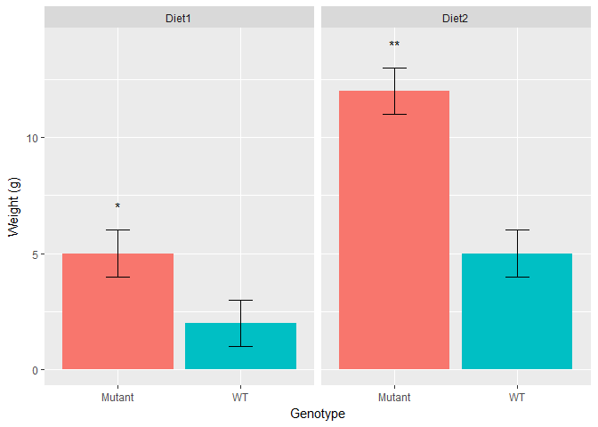

<!-- README.md is generated from README.Rmd. Please edit that file -->
### katehelpr

katehelpr can be used to analyse any data in which observations are described by a primary and secondary categorical variable, and a numeric measurement or "response". Within groups defined by the secondary variable, it compares observations with different primary variables to a reference group.

For example, it could be used to analyze the weight (response) of different mouse mutants (primary variable) compared to the wild-type (reference) when fed different diets (secondary variable).

The package was designed to analyse macrophage alternative activation states (aka polarization), so function names include 'pol()' and the default primary label for the plot is "Polarization."

### Installation

``` r
devtools::install_github("ksedivyhaley/katehelpr")
```

### Demo

``` r
suppressPackageStartupMessages(library(dplyr))
library(katehelpr)
```

It is often convenient to collect data in a format like this, for human readability:

``` r
(data <- tibble(
   'WT-Diet1' = 1:3,
   'Mutant-Diet1'= 4:6,
   'WT-Diet2' = 4:6,
   'Mutant-Diet2' = 11:13
))
#> # A tibble: 3 × 4
#>   `WT-Diet1` `Mutant-Diet1` `WT-Diet2` `Mutant-Diet2`
#>        <int>          <int>      <int>          <int>
#> 1          1              4          4             11
#> 2          2              5          5             12
#> 3          3              6          6             13
```

katehelpr can tidy this data and obtain statistical summaries, comparing the mutant to the WT for each diet:

``` r
(analysed <- data %>%
  tidy_pol() %>%
  analyse_pol(reference="WT")
)
#> # A tibble: 4 × 5
#>   primary secondary  mean    sd     p.value
#>     <chr>     <chr> <dbl> <dbl>       <dbl>
#> 1      WT     Diet1     2     1 1.000000000
#> 2  Mutant     Diet1     5     1 0.021311641
#> 3      WT     Diet2     5     1 1.000000000
#> 4  Mutant     Diet2    12     1 0.001016663
```

...and then use this data to plot a bar graph.

``` r
plot_pol(analysed, xlab="Genotype", ylab="Weight (g)", label="p.star")
```



A helper function get\_pstar() can translate p-values into star symbols.

``` r
mutate(analysed, p.star = get_pstar(p.value))
#> # A tibble: 4 × 6
#>   primary secondary  mean    sd     p.value p.star
#>     <chr>     <chr> <dbl> <dbl>       <dbl> <fctr>
#> 1      WT     Diet1     2     1 1.000000000       
#> 2  Mutant     Diet1     5     1 0.021311641      *
#> 3      WT     Diet2     5     1 1.000000000       
#> 4  Mutant     Diet2    12     1 0.001016663     **
```

For more detail, see `browseVignettes("katehelpr")`
